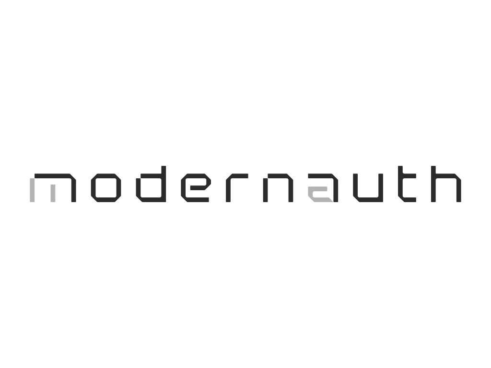

<p align="center">
  
</p>

# ModernAuth

A modern, Go-native authentication & identity core.

## Overview

ModernAuth  is a Go-native authentication and identity core intended to be embedded into products (SaaS, control panels, developer platforms) or run as a standalone auth service.

## Features

- **Go-Native**: Built with Go 1.23+ following Clean Architecture.
- **Multi-tenancy**: Built-in support for isolated tenants (organizations) with custom settings and domains.
- **RBAC**: Role-Based Access Control with roles, permissions, and middleware.
- **Config Management**: Centralized configuration via environment variables and `.env` files using `cleanenv`.
- **MFA (TOTP)**: Built-in support for Time-based One-Time Passwords with backup codes.
- **OAuth2 Social Login**: Google, GitHub, and Microsoft authentication providers.
- **SMTP Email Service**: Production-ready email with TLS support and HTML templates.
- **Password Strength Validation**: Configurable policies with common password blocking.
- **Email Verification**: Token-based email verification flow.
- **Password Management**: Secure password reset and change flows.
- **Account Lockout**: Protection against brute-force attacks with configurable lockout policies.
- **Token Blacklisting**: Redis-backed JWT access token blacklisting for immediate revocation.
- **Observability**: 
    - **Prometheus Metrics**: Request latency, counts, and authentication success/failure rates.
    - **Structured Logging**: Production-ready JSON logging using `slog`.
    - **Health Checks**: Service health endpoints with Redis connectivity status.
- **Secure Token Management**: Stateless JWT access tokens and stateful opaque refresh tokens.
- **Session Security**: Built-in token reuse detection to prevent token theft.
- **Rate Limiting**: Redis-backed rate limiting on sensitive endpoints.
- **Audit Trails**: Comprehensive database-backed audit logging for all auth events with configurable retention policy and automatic cleanup.
- **Input Validation**: Request validation using go-playground/validator.
- **Docker Ready**: Easy deployment with Docker and Docker Compose.

## Quick Start

### Prerequisites

- Go 1.23+
- Docker & Docker Compose
- Make
- PostgreSQL client (psql) for migrations

### Using the Makefile

The project includes a `Makefile` for common development tasks:

```bash
# Setup environment (manual step)
cp .env.example .env

# Start database and redis
make docker-up

# Run migrations
./scripts/migrate.sh up

# Create admin account (interactive)
./scripts/seed_admin.sh

# Build and run the server
make run

# Run tests
make test
```

### Database Migrations

The `migrate.sh` script manages database schema migrations:

```bash
# Apply all pending migrations
./scripts/migrate.sh up

# Rollback last migration
./scripts/migrate.sh down

# Check migration status
./scripts/migrate.sh status

# Reset database (rollback all migrations)
./scripts/migrate.sh reset
```

The script automatically reads database credentials from:
1. `.env` file (if exists)
2. `docker-compose.yml` (fallback)

### Creating Admin Account

Use the interactive seed script to create your first admin user:

```bash
./scripts/seed_admin.sh
```

This will:
- Read database credentials from `.env` or `docker-compose.yml`
- Prompt for admin email and password
- Hash the password using Argon2id
- Create the user with admin role assigned

### Metrics

Metrics are exposed at `/metrics` in Prometheus format.

### Running Tests

```bash
# Run all tests
go test ./...

# Run with coverage
go test -cover ./...

# Run benchmarks
go test -bench=. ./internal/auth/...
```

## Documentation

For detailed backend documentation, see:

- `docs/api.md` – full API reference (endpoints, payloads, examples)
- `docs/conf.md` – configuration and environment variables
- `docs/security.md` – security model and hardening notes
- `docs/architecture.md` – high-level architecture and components

## License

MIT License

